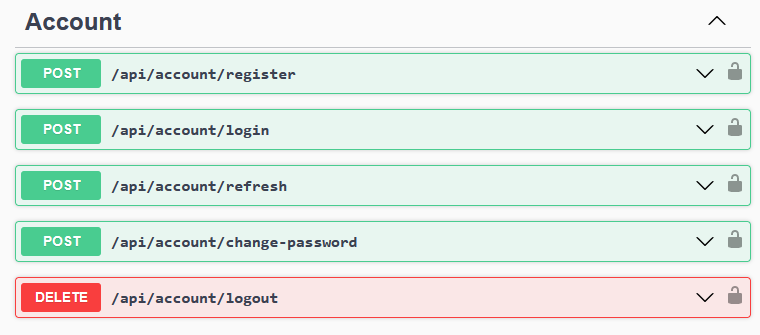
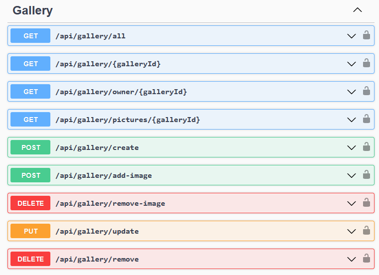
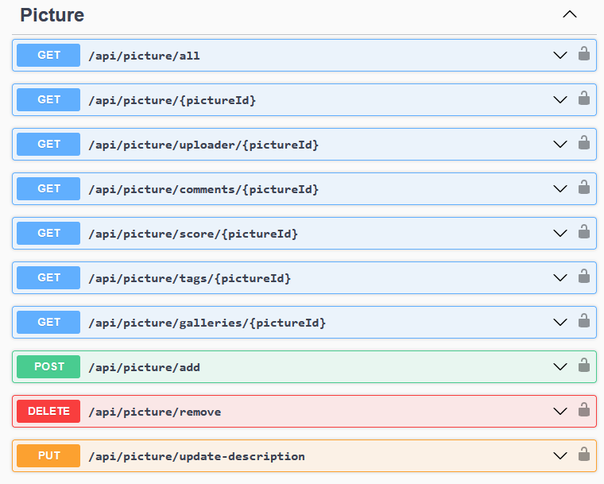
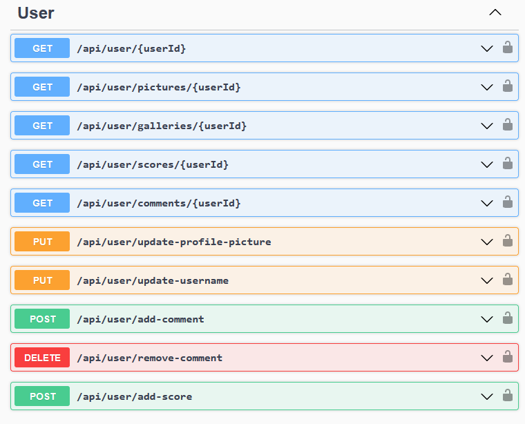
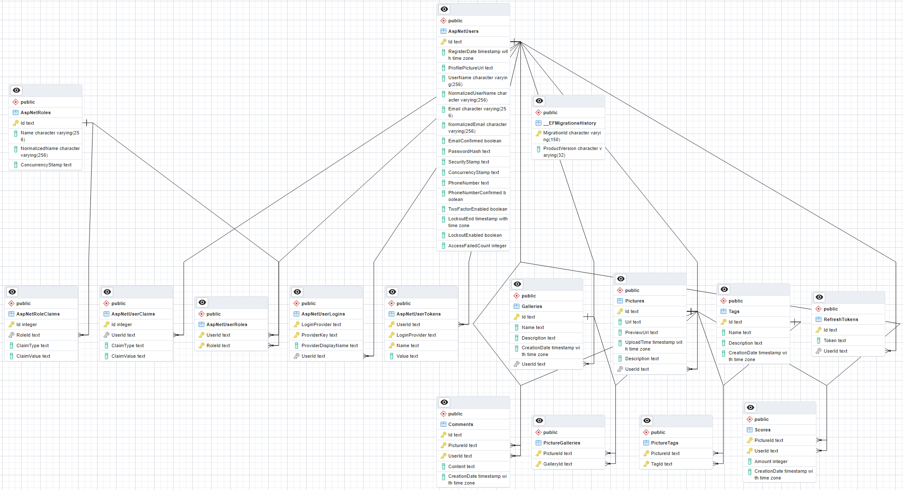

# ImageGalleries.WebApi
Relatively simple project for sharing and collecting images based on ASP.NET Core WebAPI. This project uses authentication with JSON Web tokens (JWT).

This project was created in educational purposes only.
## Demonstration
### A brief APIs showcase:

### Entity relationship diagram (ERD):

